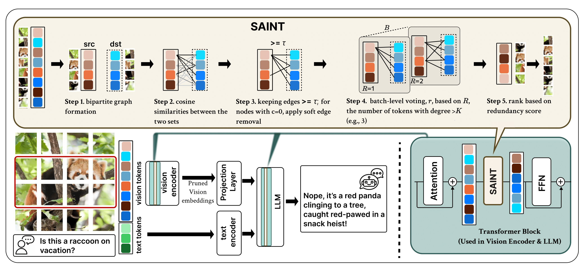

# Similarity Aware Token Pruning: Your VLM but Faster

Official PyTorch implementation of **Similarity Aware Token Pruning: Your VLM but Faster** from our paper.  
Authors: Ahmadreza Jeddi, Negin Baghbanzadeh, Elham Dolatabadi, Babak Taati

## What does SAINT do?



SAINT allows researchers and practitioners to take existing ViTs and VLMs and prune their visual tokens in a training-free setup using a graphical modeling of tokens which enables aggressive token dropping based on similarity (redundancy) in the early layers of ViT/LLM, substantially improving inference efficiency while minimizing performance loss. SAINT is:

1. **The first method** that deeply analyzes token dynamics and establishes patterns of token evolution common to both vision encoders and language models; both follow an implicit 3-stage evolution, called *aligner-explorer-aggregator* (refer to the paper).
2. **More robust** by finding that token similarity provides a stronger signal for dropping compared to attention, and that dropping beats merging in early stages.
3. **State-of-the-art (SOTA)** in performance for both ViTs and VLMs.
4. **Versatile in pruning**, being the first VLM pruning method to analyze pruning before the LLM, during the LLM, and via a hybrid approach, showcasing the performance-efficiency trade-offs.

## Usage

- **ViT:** Navigate to the `ViT` folder to see the code and the README with instructions on how to work with Vision Transformers.
- **VLM:** Navigate to the `VLM` folder to see the code and the README with instructions on how to work with Vision-Language Models.

## Citation

If you use our work or this repository in your research, please cite our paper:

```bibtex
@misc{jeddi2025similarityawaretokenpruningvlm,
      title={Similarity-Aware Token Pruning: Your VLM but Faster}, 
      author={Ahmadreza Jeddi and Negin Baghbanzadeh and Elham Dolatabadi and Babak Taati},
      year={2025},
      eprint={2503.11549},
      archivePrefix={arXiv},
      primaryClass={cs.CV},
      url={https://arxiv.org/abs/2503.11549}, 
}
```

## Acknowledgements
This repository was inspired by and builds upon the codebases from the ToMe and FastV repositories.
